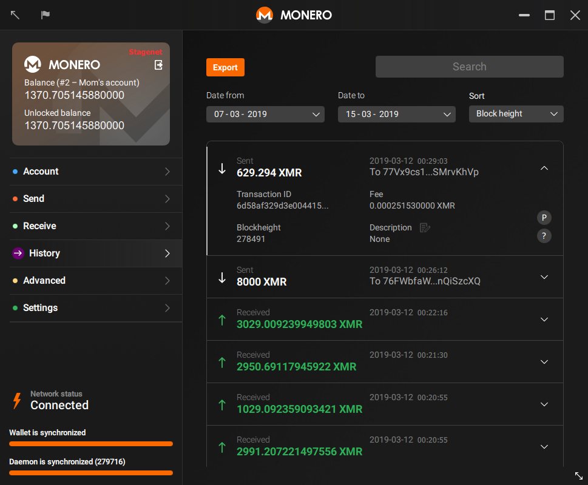
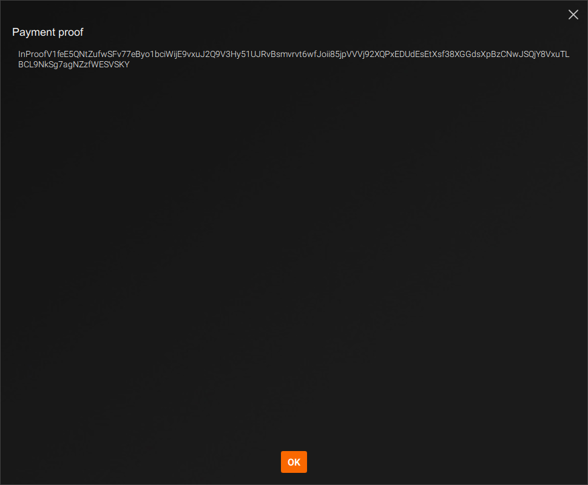
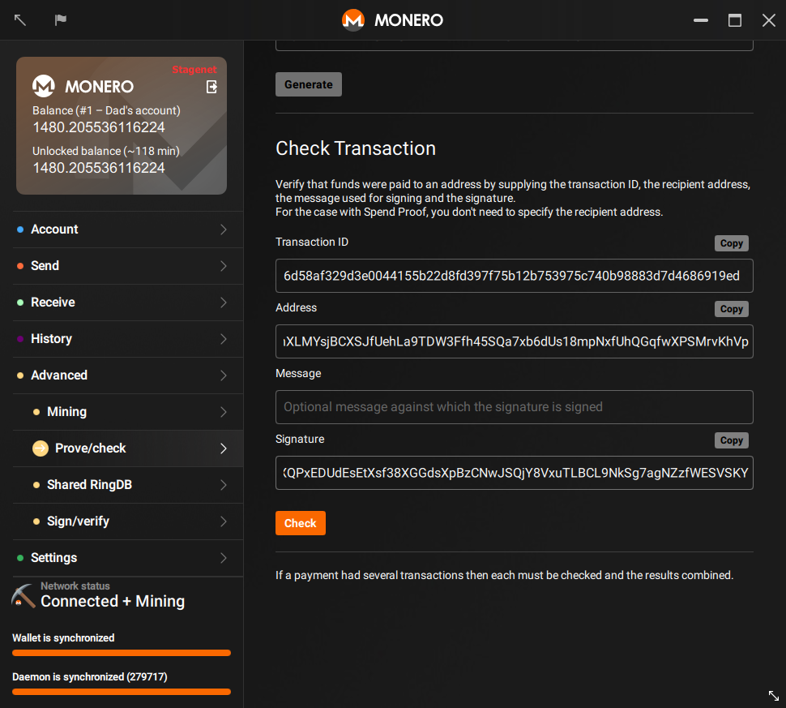
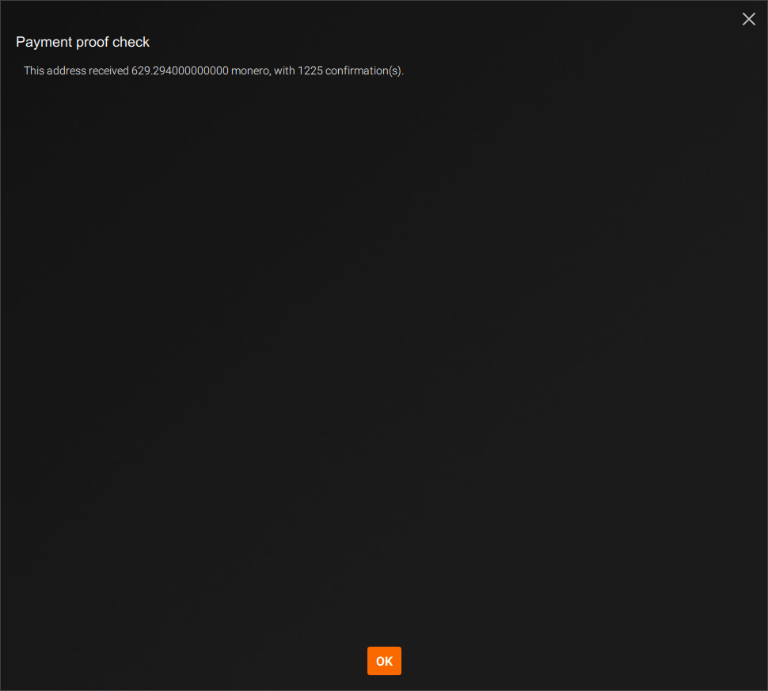



### Prove payments

When you send money to a party who then disputes the payment was made, you need to be able to prove the payment was made.

With Bitcoin, this is typically done by looking up the transaction ID, where the origin and destination addresses are
shown, along with the amount transacted.

Haven, however, is private: that information is not available publicly on the blockchain. The steps are therefore a bit
more involved.

To prove to Charlie that she made a payment to Bob, Alice must supply Charlie three pieces of information:

- the transaction ID, as is done in Bitcoin
- Bob's address, as is done with Bitcoin
- the transaction's key, which is new with Haven and other CryptoNote currencies

When Alice made the transaction, a one time key was automatically generated just for this transaction.

#### CLI

Alice can query it thus in haven-wallet-cli (new name for the old simplewallet):

> get_tx_key TXID

Alice would plug in her actual transaction ID instead of this TXID placeholder. All being well, the one time transaction key
will be displayed.

Note that this will only work if haven-wallet-cli is set to save transaction keys. To double check:

> set

If it's set to 0, set it to 1:

> set store-tx-info 1

#### GUI

Alice can open her haven-wallet-gui and go to the history page to see her transaction detail:

Here, she can copy the transaction ID and Bob's address by clicking on each of them.
Then she can click on `P` to get a payment proof (transaction key):

---

Alice can now send Charlie the transaction key along with transaction ID and Bob's address.

Note: if several transactions were made, this needs repeating for each such transaction.

### Check payments

Charlie now received those three pieces of information, and wants to check Alice is telling the truth: on an up to date
blockchain,

#### CLI

Charlie types in haven-wallet-cli:

> check_tx_key TXID TXKEY ADDRESS

The information supplied by Alice plugs neatly instead of the placeholders. haven-wallet-cli will use the transaction
key to decode the transaction, and display how much this particular transaction sent to this address. Obviously,
Charlie will want to double check with Bob the address is really his - same as with Bitcoin.

#### GUI

Charlie will open his haven-wallet-gui and go to the Advanced > Prove/Check page to fill the Check section with the informations provided by Alice:

Then clicking on Check will tell Charlie how much this particular transaction sent to this address, and how much confirmation the transaction had:

---

Obviously, Charlie will want to double check with Bob the address is really his - same as with Bitcoin.

Note: if several transactions were made, this needs repeating for each such transaction.
